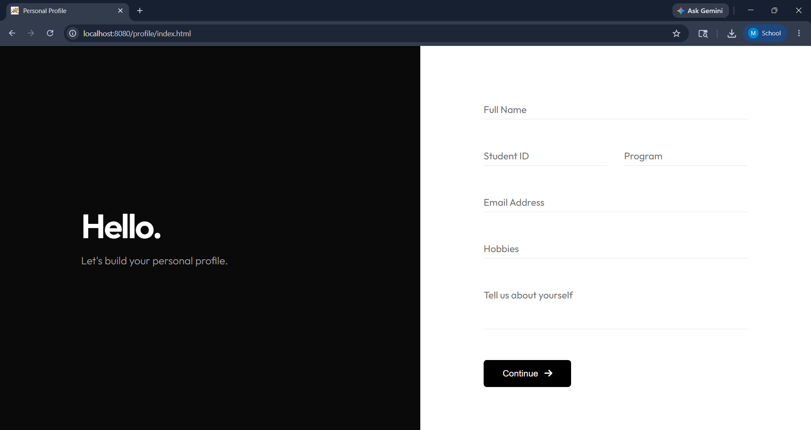
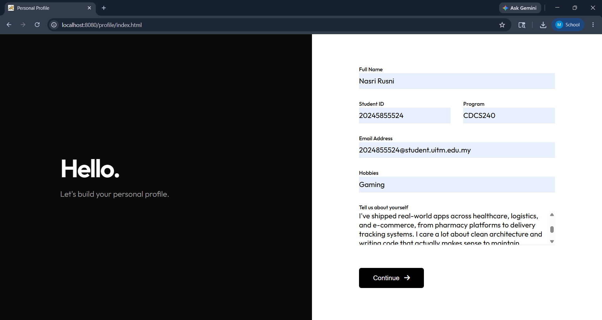
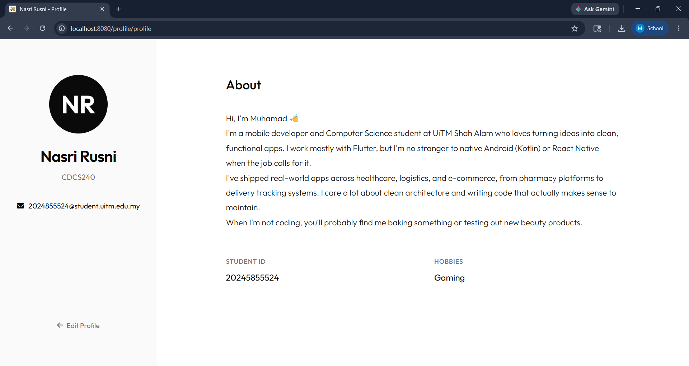

# Personal Profile Web Application

Simple web app demonstrating **HTML Form → Servlet (HTTP POST) → JSP**.

## Flow
1. `index.html` — styled form, submits via `POST` to `/profile`.
2. `ProfileServlet.java` — reads the parameters, sets them as request attributes, forwards to the JSP.
3. `result.jsp` — renders the submitted profile neatly.

## Demo

**1. Empty form** (`index.html`)



**2. Filled form** — ready to submit via HTTP POST



**3. Result** — Servlet processes the POST and forwards to `result.jsp`



## Tech
- HTML5 + CSS3 (responsive, Font Awesome icons)
- Java Servlet 4.0 (`javax.servlet`)
- JSP

## Project structure
```
Personal Profile Web/
├── pom.xml
└── src/main/
    ├── java/com/nasri/profile/ProfileServlet.java
    └── webapp/
        ├── index.html
        ├── result.jsp
        ├── css/style.css
        └── WEB-INF/web.xml
```

## How to run

### Requirements
- JDK 8 (installed)
- Apache **Tomcat 9.x** (uses the `javax.servlet` namespace — do NOT use Tomcat 10+, which switched to `jakarta.servlet`)
- Maven (to build the `.war`) — or just deploy through an IDE.

### Option A — IDE (NetBeans / Eclipse / IntelliJ)
1. Open the folder as a Maven project.
2. Add a Tomcat 9 server.
3. Right-click project → Run on Server.
4. Browser opens at `http://localhost:8080/profile/`

### Option B — Maven + Tomcat manually
```powershell
mvn clean package
# produces target/profile.war
# copy it into Tomcat:
copy target\profile.war "C:\path\to\tomcat9\webapps\"
# start Tomcat, then open:
# http://localhost:8080/profile/
```

## URLs
- Form:   `http://localhost:8080/profile/`        (index.html)
- Servlet: `http://localhost:8080/profile/profile` (POST target)
