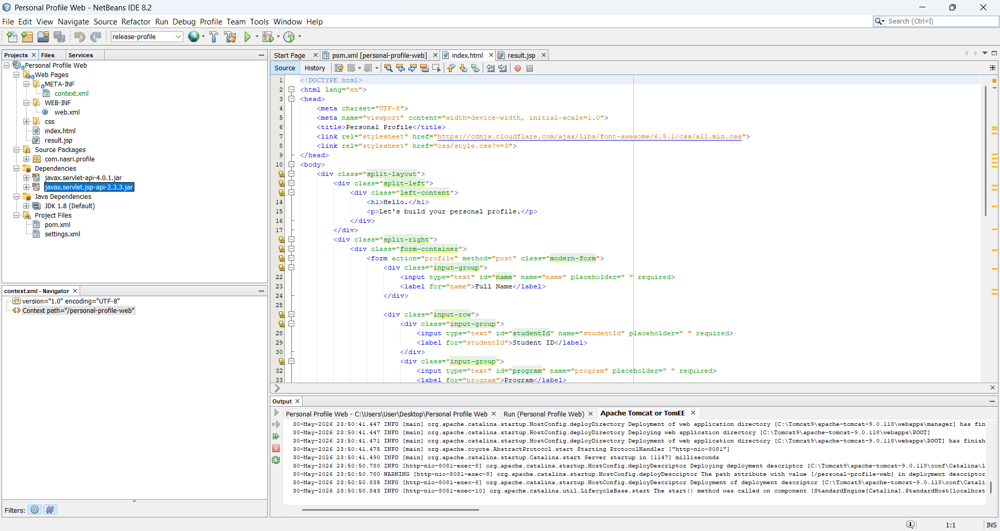

# Personal Profile Web Application

Simple web app demonstrating **HTML Form → Servlet (HTTP POST) → JSP**.

## Flow
1. `index.html` — styled form, submits via `POST` to `/profile`.
2. `ProfileServlet.java` — reads the parameters, sets them as request attributes, forwards to the JSP.
3. `result.jsp` — renders the submitted profile neatly.

## Demo

**1. Empty form** (`index.html`)


**2. Filled form** — ready to submit via HTTP POST


**3. Result** — Servlet processes the POST and forwards to `result.jsp`


## Tech
- HTML5 + CSS3 (responsive, Font Awesome icons)
- Java Servlet 4.0 (`javax.servlet`)
- JSP

## Project structure
```
Personal Profile Web/
├── pom.xml
└── src/main/
    ├── java/com/nasri/profile/ProfileServlet.java
    └── webapp/
        ├── index.html
        ├── result.jsp
        ├── css/style.css
        └── WEB-INF/web.xml
```

## How to run

### Requirements
- JDK 8
- Apache **Tomcat 9.x** (uses the `javax.servlet` namespace — do NOT use Tomcat 10+, which switched to `jakarta.servlet`)
- **NetBeans IDE 8.2** (bundles Maven)

### Run in NetBeans IDE 8.2
1. **File → Open Project** → select the `Personal Profile Web` folder (NetBeans detects the Maven `pom.xml`).
2. Register Tomcat once: **Tools → Servers → Add Server → Apache Tomcat or TomEE**.
   - **Server Location**: your Tomcat 9 folder (e.g. `C:\Tomcat9\apache-tomcat-9.0.118`).
   - Set a manager **Username / Password** and keep *Create user if it does not exist* checked.
3. Right-click the project → **Run** (or press the green ▶).
4. NetBeans builds the WAR, deploys to Tomcat, and opens the browser automatically.



### Build the WAR from the command line (optional)
```powershell
mvn clean package
# produces target/profile.war  -> copy into <tomcat>/webapps/
```

## URLs
- Form:   `http://localhost:8080/profile/`        (index.html)
- Servlet: `http://localhost:8080/profile/profile` (POST target)
